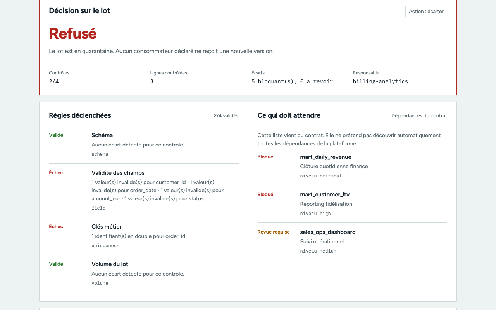

# Pacte

Pacte est une démo de contrôle de lots CSV avant ingestion. Elle part d’un cas précis : un export quotidien de commandes peut changer sans prévenir, alors que des tableaux et traitements attendent encore l’ancien format.

Le périmètre est volontairement petit. Pour un fichier et un contrat versionné, Pacte calcule une décision reproductible (admettre, demander une revue ou écarter le lot) et l’enregistre dans un reçu local.

Démo en ligne : https://pacte-ikel.onrender.com (instance gratuite Render, le premier chargement peut prendre une minute).



La capture montre l’export aux valeurs invalides : le lot est refusé, deux contrôles sur quatre échouent et deux des trois consommateurs déclarés sont bloqués.

## Les scénarios fournis

Trois exports de commandes synthétiques sont inclus dans `data/`. Le fichier conforme passe. Celui qui contient une date invalide, un montant négatif, un client manquant, un statut inconnu et une clé en double est écarté. Celui qui ajoute une colonne `currency` attend une revue avant toute publication.

## Ce qui est réellement contrôlé

- en-têtes manquants, dupliqués ou inattendus ;
- lignes vides ou valeurs sans en-tête ;
- champs obligatoires, types, bornes et valeurs autorisées ;
- unicité de la clé métier ;
- présence de lignes dans le lot ;
- empreinte SHA-256 du fichier brut et du contrat évalué ;
- reçu local idempotent : rejouer exactement le même fichier avec le même contrat retrouve le même run.

Les conséquences affichées viennent de la liste de consommateurs déclarée dans le contrat. Elles ne constituent pas une découverte automatique de dépendances.

## Les trois décisions

```text
accept      le lot respecte le contrat, la démo autoriserait la publication
review      un écart non bloquant doit être compris par le propriétaire avant publication
quarantine  un contrôle bloquant échoue, le lot est maintenu à l’écart
```

Le prototype calcule et enregistre cette décision. Il n’écrit pas dans une table métier, n’arrête pas de job et n’envoie pas d’alerte externe.

## Lancer localement

```bash
cd pacte
PYTHONPATH=src python3 -m pacte.server
```

Ouvrir ensuite `http://localhost:8090`, choisir un des trois exports, puis lire les règles déclenchées, les conséquences déclarées et le reçu local.

## Vérifier le projet

```bash
PYTHONPATH=src python3 -m unittest discover -s tests -v
```

La suite couvre le lot conforme, la dérive de schéma, les erreurs de qualité, un lot vide, un contrat invalide et l’idempotence du reçu.

## API de démonstration

- `GET /api/health` expose la version et l’empreinte du contrat chargé.
- `GET /api/overview` retourne le contrat, les lots fournis et les derniers reçus locaux.
- `GET /api/audit` retourne l’historique compact des exécutions.
- `GET /api/runs/{run_id}` retrouve une exécution précise.
- `POST /api/validate` avec `{ "batch": "orders_clean.csv" }` lance les contrôles sur un lot inclus dans `data/`.

## Limites assumées

Le SLA de fraîcheur est déclaré dans le contrat, mais non mesuré : les CSV de démonstration ne contiennent pas d’horodatage de livraison fiable. SQLite est suffisant pour inspecter le comportement localement, pas pour conserver un audit d’équipe durable. Une évolution réaliste demanderait un manifeste de livraison, une revue avec auteur et raison, un stockage partagé et une stratégie d’alerte.

La [fiche de travail](docs/working-paper.md) décrit les compromis et les prochaines questions.
